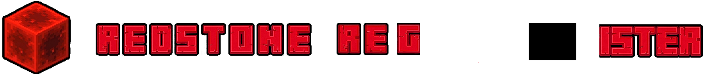

## What this repo is
This repository is a Flask-based Progressive Web App (PWA) for a catalogue called **Redstone Register**.

The goal will be to catalouge all the unique redstone components in Minecraft, totalling around 40 entries.

It will display database-driven catalogue cards which will be expandable into their own (templated) pages with details and a link to their wiki page on the Minecraft wiki. 

## Tech stack
- Python + Flask backend
- SQLite database
- Jinja2 templates
- HTML/CSS/JavaScript frontend
- PWA features via `static/manifest.json` and `static/js/serviceworker.js`

