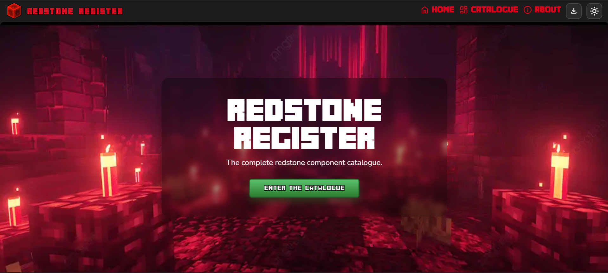
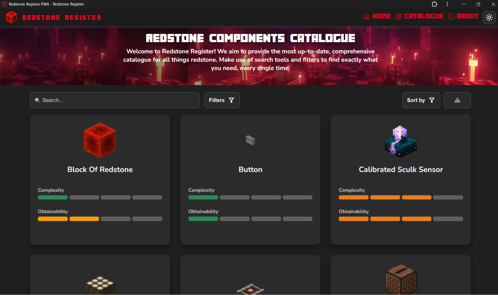

# Redstone Register

A Flask-based Progressive Web App (PWA) that catalogues all 46 redstone components in Minecraft. Browse, search, filter, sort, and pin components — all from a responsive, installable web application that works offline.



## Features

- **Comprehensive catalogue** — All 46 redstone components with images, descriptions, crafting recipes, complexity ratings, obtainability ratings, and wiki links.
- **Search** — Real-time text search with input sanitisation.
- **Filtering** — Filter by category (Power, Transmission, Mechanism, Mobile) and by complexity/obtainability level.
- **Sorting** — Sort alphabetically, by complexity, or by obtainability in ascending or descending order.
- **Pinning** — Pin components locally for quick reference (persisted in the browser).
- **Detail modals** — Click any card to view full details including crafting recipe and a link to the Minecraft Wiki.
- **Dark/Light theme** — Toggle between themes; preference is saved locally.
- **PWA support** — Installable on desktop and mobile with full offline functionality via a service worker.
- **Responsive design** — Optimised for desktop, tablet, and mobile with a collapsible navigation bar.
- **Security hardened** — Content Security Policy headers, input validation, parameterised SQL queries, and no inline JavaScript.

## Tech Stack

| Layer | Technology |
|-------|-----------|
| Backend | Python 3, Flask |
| Database | SQLite via SQLAlchemy |
| Templating | Jinja2 |
| Frontend | HTML5, CSS3 (custom properties), vanilla JavaScript |
| PWA | Web App Manifest, Service Worker (cache-first for assets, network-first for pages) |
| Fonts | Nunito, Minecrafter, Material Symbols Outlined (self-hosted) |

## Project Structure

```
Redstone-Register-PWA/
├── main.py                  # Flask application entry point
├── database_manager.py      # SQLAlchemy database queries
├── requirements.txt         # Python dependencies
├── database/
│   └── data_source.db       # SQLite database with component data
├── templates/
│   ├── layout.html          # Base template
│   ├── home.html            # Landing page
│   ├── catalogue.html       # Main catalogue page
│   ├── about.html           # About page with FAQ
│   ├── offline.html         # Offline fallback page
│   └── partials/
│       ├── menu.html        # Navigation bar partial
│       └── footer.html      # Footer partial
├── static/
│   ├── manifest.json        # PWA manifest
│   ├── css/
│   │   ├── style.css        # Main stylesheet
│   │   └── theme-variables.css  # CSS custom properties for theming
│   ├── js/
│   │   ├── app.js           # Service worker registration & install prompt
│   │   ├── catalogue.js     # Catalogue search, filter, sort logic
│   │   ├── pinning.js       # Component pinning functionality
│   │   ├── home.js          # Home page interactions
│   │   ├── about.js         # FAQ accordion logic
│   │   ├── theme.js         # Theme toggle (dark/light)
│   │   └── serviceworker.js # Service worker for offline caching
│   ├── fonts/               # Self-hosted web fonts
│   ├── icons/               # PWA icons and screenshots
│   └── images/              # Component images, backgrounds, and UI assets
└── docs/                    # Documentation and README resources
```

## Getting Started

### Prerequisites

- Python 3.10 or later
- pip

### Installation

1. Clone the repository:
   ```bash
   git clone https://github.com/Zechariah/Redstone-Register-PWA.git
   cd Redstone-Register-PWA
   ```

2. Create and activate a virtual environment:
   ```bash
   python -m venv .venv
   # Windows
   .venv\Scripts\activate
   # macOS / Linux
   source .venv/bin/activate
   ```

3. Install dependencies:
   ```bash
   pip install -r requirements.txt
   ```

4. Run the application:
   ```bash
   python main.py
   ```

5. Open your browser and navigate to `http://127.0.0.1:5000`

## Pages

| Route | Description |
|-------|-------------|
| `/` | Home — hero section with links to the catalogue and about page |
| `/catalogue` | Catalogue — searchable, filterable grid of all redstone components |
| `/about` | About & FAQ — project background and frequently asked questions |
| `/offline` | Offline fallback — shown when network is unavailable and page is not cached |

## PWA & Offline Support

Redstone Register can be installed as a standalone app on supported browsers. The service worker caches core assets on install and uses a network-first strategy for HTML pages, falling back to cached versions or a dedicated offline page when the network is unavailable.



## Security

- **Content Security Policy** — Strict CSP disallowing inline scripts and styles.
- **Input validation** — Search queries are sanitised on both client and server side with length limits and character whitelisting.
- **Parameterised queries** — All database access uses SQLAlchemy's `text()` with bound parameters to prevent SQL injection.
- **Security headers** — `X-Frame-Options`, `X-Content-Type-Options`, `Referrer-Policy`, and `Strict-Transport-Security` (on HTTPS) are set on every response.
- **Debug disabled** — The application runs with `debug=False` in production.

## Licence

This project is available under the licence specified in [LICENSE](LICENSE).
